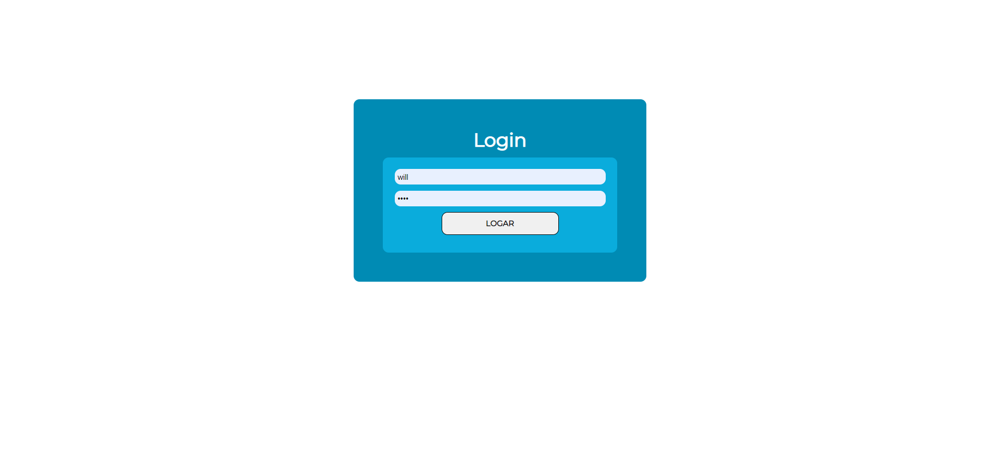

# Projeto de blog para treinar as habilidades com NodeJS, MongoDB, e React.  

 

## Página Inicial:

## Página do post selecionado:

## Busca por nome dos posts:

## Sistema de login para acessar o painel

## Sistema de gerenciamento de publicações

